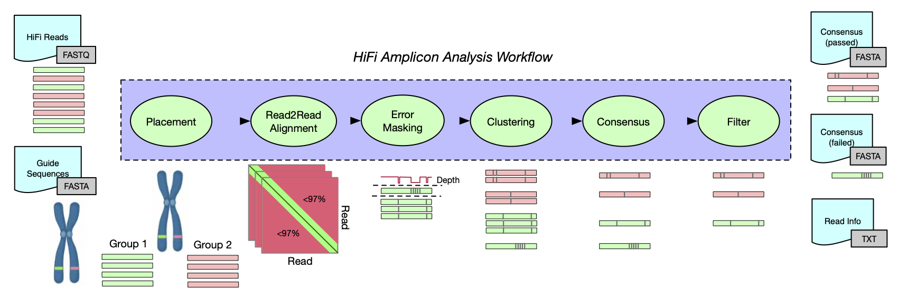
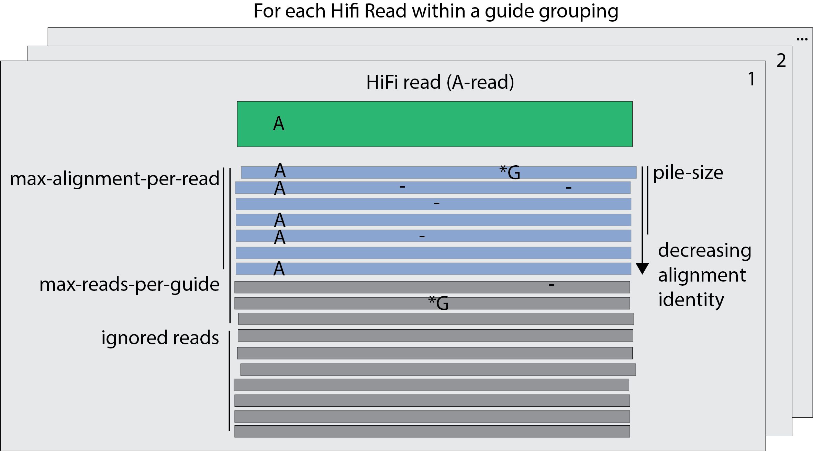

<p align="center">
  
</p>
<h1 align="center"><i>pbaa</i></h1>
<p align="center">PacBio Amplicon Analysis</p>

***

PacBio Amplicon Analysis (_pbaa_) separates complex mixtures of amplicon targets from genomic samples. The _pbaa_ application is designed to cluster and generate high-quality consensus sequences from HiFi reads. This application only works on HiFi amplicon data. There are several assumptions made within the code that will only support high quality reads (>QV20). This application will not work on CLR data. _pbaa_ is reference aided method (pseudo de-novo).

Typical use cases involve multi-allelic samples where the sample-specific ploidy or copy number is unknown. _pbaa_ can effectively separate alleles with one to many variants, including SNVs and large indels contained within the target region. _pbaa_ has been optimized and tested for datasets with a moderate to high (<50) cluster counts.

## Workflow


## Availability
The latest version can be installed via bioconda package `pbaa`.

Please refer to our [official pbbioconda page](https://github.com/PacificBiosciences/pbbioconda)
for information on Installation, Support, License, Copyright, and Disclaimer.

[Full changelog here](#full-changelog)

## Usage
_pbaa_ has two executables, cluster and bam paint.

```
pbaa - PacBio HiFi Amplicon Analysis.

Usage:
  pbaa <tool>

  -h,--help    Show this help and exit.
  --version    Show application version and exit.

Tools:
  cluster    Run clustering tool.
  bampaint   Add color tags to BAM records, based on pbaa clusters.

```

### Main clustering tool
This tool runs the placement, clustering, and consensus algorithms.

```
pbaa cluster - Run clustering tool.

Usage:
  pbaa cluster [options] <guide input> <read input> <prefix>

  guide input                FILE   Guide sequence(s) in fasta format indexed with samtools faidx version 1.9 or
                                    greater. A FOFN can be provide for multiple files.
  read input                 FILE   De-multiplexed HiFi reads in fastq format indexed with samtools fqidx version 1.9
                                    or greater. A FOFN can be provide for multiple files.
  prefix                     STR    Output prefix for run.

Placement and Variant Options:
  --filter                   INT    Variants with coverage lower than filter will be ignored. [3]
  --trim-ends                INT    Number of bases to trim from both sides of reads during graph construction and
                                    variant detection. [5]
  --pile-size                INT    The number of best alignments to keep for each read during error correction. [30]
  --min-var-frequency        FLOAT  Minimum coverage frequency within a pile. [0.3]
  --max-alignments-per-read  INT    The number of random alignments, for each read, within a guide grouping [1000]

Clustering Options:
  --max-reads-per-guide      INT    The number randomly selected reads to use within a guide grouping. [500]
  --iterations               INT    Number of iterations to run k-means. [9]
  --seed                     INT    Randomization seed. [1984]

Consensus Options:
  --max-consensus-reads      INT    Maximum number of reads to use per cluster consensus. [100]

Filtering Options:
  --max-amplicon-size        INT    Upper read length cutoff, longer reads will be skipped. [15000]
  --min-read-qv              FLOAT  Low read QV cutoff. [20]
  --off-target-groups        STR    Group names to exclude, i.e. these loci are off-target (not amplified).
  --min-cluster-frequency    FLOAT  Low frequency cluster cutoff. [0.1]
  --min-cluster-read-count   INT    Low read count cluster cutoff. [5]
  --max-uchime-score         FLOAT  High UCHIME score cutoff. [1]

General Options:

  -h,--help                         Show this help and exit.
  --version                         Show application version and exit.
  -j,--num-threads           INT    Number of threads to use, 0 means autodetection. [0]
  --log-level                STR    Set log level. Valid choices: (TRACE, DEBUG, INFO, WARN, FATAL). [WARN]
  --log-file                 FILE   Log to a file, instead of stderr.
  ```
### Coloring reads by clusters
If you have a BAM file (mapped amplicon reads) this tool will add IGV tags for grouping (HP) and coloring (YC). It matches the read names in the clustering file, and the BAM file. The amplicon reads can be aligned against any reference.

```
pbaa bampaint - Add color tags to BAM records, based on pbaa clusters.

Usage:
  pbaa bampaint [options] <read info file> <input bam> <output bam>

  read info file    FILE  Read information file produced by pbaa cluster.
  input bam         FILE  Bam file to add color tags.
  output bam        FILE  Output bam file name.

Options:
  -h,--help               Show this help and exit.
  --version               Show application version and exit.
  -j,--num-threads  INT   Number of threads to use, 0 means autodetection. [0]
  --log-level       STR   Set log level. Valid choices: (TRACE, DEBUG, INFO, WARN, FATAL). [WARN]
  --log-file        FILE  Log to a file, instead of stderr.
```

## Input

_pbaa_ requires two input files, guide/reference sequences in fasta file format and HiFi de-multiplexed reads in fastq file format (indexed with fqidx). Guide/reference sequences should contain the amplified region, but not much more. Providing a chromosome as a guide, for example, will lead to issues during read placement.

_pbaa_ supports batching of samples via the FOFN (file of file name[s]) format. A FOFN is a line separated file  that contains the **full paths** to the input files. **All input sequence files need to be indexed before running _pbaa_.** Indexing can be achieved with _samtools_ version 1.9 or greater.

## Customizing guide sequences

Guide/reference sequence choice affects read grouping/placement. It is important to choose guides that are sufficiently divergent. If too many similar alleles are used for the same locus the fraction of un-placed reads will increase because the number of informative guide kmers decreases. Too few guides can also cause cluster dropout; it's the goldilocks problem.

Guide sequences should be grouped into locus assignments. For example if multiple HLA-A alleles are used in the guide sequence, they should be grouped, so clustering will be performed at the locus level.  

```
Allele_1|HLA-A (sequence name | group name)
Allele_2|HLA-A (sequence name | group name)
```

In the example above, reads assigned to either allele (1,2) will be merged into a single dataset for clustering.
For more details on setting up guides see `guide_reference.md`


## Output

_pbaa_ will generate three output files.

1. {prefix}_passed_cluster_sequences.fasta
2. {prefix}_failed_cluster_sequences.fasta
3. {prefix}_read_info.txt


### consensus sequence output

The headers entries in the consensus sequence output contain statistics about the clusters. These statistics are used for filtering (pass/fail criterion).

example of a passing sequence:

```
>sample-bc1001--bc1001_guide-HLA-A_cluster-1_ReadCount-22 uchime_score:-1 uchime_left_parent:N/A uchime_right_parent:N/A cluster_freq:0.44 diversity:0.188552 avg_quality:53.5878 duplicate_parent:N/A seq_length:3152 filters:none
```

example of a failing sequence:

```
>sample-bc1011--bc1011_guide-HLA-DRB1_cluster-3_ReadCount-6 uchime_score:0.03125 uchime_left_parent:bc1011--bc1011_HLA-DRB1_0 uchime_right_parent:bc1011--bc1011_HLA-DRB1_1 cluster_freq:0.12 diversity:0 avg_quality:42.2187 duplicate_parent:N/A seq_length:3706 filters:fail-low-frequency
```

The fields in the header are:

1. **uchime_score** The UCHIME score flags chimeric consensus sequences. The higher the score the more likely the sequence is chimeric. For more details see: Edgar, Robert C., et al. “UCHIME improves sensitivity and speed of chimera detection.” Bioinformatics 27.16 (2011): 2194-2200.

2. **uchime_left_parent/uchime_right_parent** The parent sequences of a chimeric sequence.

3. **cluster_freq** A measures of the clusters’ frequencies. The frequency is calculated by reads counts within groupings.

4. **diversity** A measure of the variability of variants within a cluster. Clusters with homogenous reads will have low diversity. A negative value indicates this metric was not calculated.

5. **avg_quality** The average PHRED quality of the reads within the cluster.

6. **seq_length** The sequence length of the cluster.

6. **filters** This is a space separated field enumerating the possible reasons a cluster was placed in the fail category.

### Read Information Output File
One row per read, columns as follows:
1. SeqName
2. GuideName
3. strand
4. SecondBestGuideName
5. Score
6. FirstHighest/SecondHighest/UniqueHitSum
7. Sample, input fastq
8. Sequence length
9. Average read quality
10. Cluster ID
11. Cluster Size

**_Example:_**
```
m64012_200712_164638/72090819/ccs HLA-DRB5 - HLA00622_DQB1_02-01-01_7480_bp|HLA-DQB1 0.714286 f:5/s:2/sum:8 /pbi/dept/appslab/projects/old/2020/jh_hla/2020-07-13_HGgendx/fastq_sqII/demultiplex.bc1099--bc1099.fastq 3125 58.6149 1 1
```

## Best practices

### Sample preparation and sequencing  

[Targeted Sequencing For Amplicons Document](https://www.pacb.com/wp-content/uploads/Application-Brief-Targeted-sequencing-Best-Practices.pdf)


### Use defaults
We've optimized the default parameters to perform well on several datasets. In general use the defaults unless needed. If you discover an edge case, please share this experience.

### Provide an off-target-groups file.
Amplification can generate off target reads. Similarly, pbaa can accidentally place a few reads in the wrong grouping/locus. These reads may generate clusters that are off-target (not amplified). By providing a list of guide-names / group-names (one per line), pbaa will filter these out.

### Understanding the error correction stage options


There are four hurestics to consider adjusting depending on the experiment (_max-reads-per-guide_, _max-alignments-per-read_, _pile-size_, _min-var-frequency_). In the above image, there are a total of _max-reads-per-guide_ to consider for each HiFi (A-read). An A-read is randomly aligned to _max-alignments-per-read_. These alignments are sorted in decreasing sequence idenity. A total of _pile-size_ reads are retained to correct the A-read. The _min-var-frequency_ is the fraction of reads within a _pile_ that support that the A-read is correct at any position along the A-read.


## Advanced / Hidden Options

A number of heuristics and advanced options are hidden from the interface. They are documented here, but consider them experimental features. Changing these settings can have undesired effects.

**_--skip-consensus_** : Only run read placement and clustering. No consensus sequences will be generated.

**_--skip-chimera-detection_** : Skip chimera detection (UCHIME algorithm) step.

**_--kmer-size_** : Kmer size, not to exceed 31, length must be odd. This only affects read placement.

## FAQ

**_Why are reads missing_** : By default _pbaa_ only uses 500 reads per locus/guide/grouping. Increasing `--max-reads-per-guide` will use more reads, at the expense of runtime/memory. If runtime is not a consideration use all the reads.

**_Considerations for pooled experiments_**: Pooled experiments are bounded by runtime/memory. The settings below increase the accuracy of the results at the expense of runtime memory.

 `--max-reads-per-guide` : Increase the number of reads uses locus/guide/grouping.

 `--max-alignments-per-read` : Increase the number of alignments per read. This setting can drastically increase computational expense.

 `--pile-size` : The number of reads to use for error masking per read.

 `--min-var-frequency` : The minimum variant frequency within a pile of reads used for error correction. Decreasing this value will increase sensitivity to low-frequency variants. This can lead to over clustering.

**_Extra false clusters_**: There are a number of reasons pbaa might generate false positive clusters. Chimeric reads, false variant calls, and clustering errors. Often the statistics in the fasta headers can provide clues. Changing filtering settings may reduce false positives.

**_Missing clusters_**: _pbaa_ was tuned for sensitivity, favoring false positives over false negatives. However, false negatives do happen at a low rate. First check if the missing cluster is in the {prefix}_failed_cluster_sequences.fasta file. Then check that there is sufficient coverage over the guide sequences, by aligning reads to the guide sequences. For this application we recommend a minimum of 25x depth of coverage per allele. If there is coverage check for missed variants. If you believe pbaa failed to discover a variant resulting in a false negative, please share a small example. Variant discover is the most challenging step in _pbaa_.

**_Feedback or bug report_**: Please share your experiences via [Github issue](https://github.com/PacificBiosciences/pbbioconda/issues).

## Disclaimer
THIS WEBSITE AND CONTENT AND ALL SITE-RELATED SERVICES, INCLUDING ANY DATA, ARE PROVIDED "AS IS," WITH ALL FAULTS, WITH NO REPRESENTATIONS OR WARRANTIES OF ANY KIND, EITHER EXPRESS OR IMPLIED, INCLUDING, BUT NOT LIMITED TO, ANY WARRANTIES OF MERCHANTABILITY, SATISFACTORY QUALITY, NON-INFRINGEMENT OR FITNESS FOR A PARTICULAR PURPOSE. YOU ASSUME TOTAL RESPONSIBILITY AND RISK FOR YOUR USE OF THIS SITE, ALL SITE-RELATED SERVICES, AND ANY THIRD PARTY WEBSITES OR APPLICATIONS. NO ORAL OR WRITTEN INFORMATION OR ADVICE SHALL CREATE A WARRANTY OF ANY KIND. ANY REFERENCES TO SPECIFIC PRODUCTS OR SERVICES ON THE WEBSITES DO NOT CONSTITUTE OR IMPLY A RECOMMENDATION OR ENDORSEMENT BY PACIFIC BIOSCIENCES.


## Full Changelog

* 1.0.0: April 23rd, 2021
 1. Major algorithm refactor, and many changes to CLI.

* For previous releases please see [beta release documentation](README_BETA.md)
