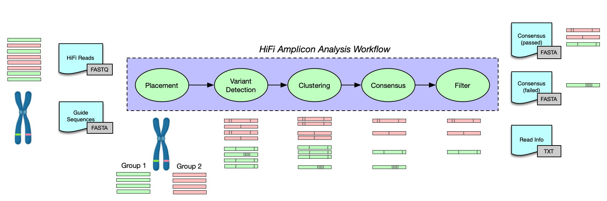

# PacBio Amplicon Analysis (_pbaa_)


PacBio Amplicon Analysis (_pbaa_) separates complex mixtures of amplicon targets from genomic samples. The _pbaa_ application is designed to cluster and generate high-quality consensus sequences from HiFi reads. This application only works on HiFi amplicon data. There are several assumptions made within the code that will only support high quality reads (>QV20). This application will not work on CLR data. _pbaa_ is reference aided method (pseudo de-novo).

Typical use cases involve multi-allelic samples where the sample-specific ploidy or copy number is unknown. _pbaa_ can effectively separate alleles with one to many variants, including SNVs and large indels contained within the target region. _pbaa_ has been optimized and tested for datasets with a moderate (<10) cluster count.  Feedback for higher cluster density is welcome and may be addressed in future releases.  

## Workflow


## Availability
Latest version can be installed via bioconda package `pbaa`.

Please refer to our [official pbbioconda page](https://github.com/PacificBiosciences/pbbioconda)
for information on Installation, Support, License, Copyright, and Disclaimer.

## Latest Version
Version **0.1.2**: [Full changelog here](#full-changelog)

## Usage
_pbaa_ has two executables, cluster and bam paint.

```
pbaa - PacBio HiFi Amplicon Analysis.

Usage:
  pbaa <tool>

  -h,--help    Show this help and exit.
  --version    Show application version and exit.

Tools:
  cluster    Run clustering tool.
  bampaint   Add color tags to BAM records, based on pbaa clusters.

```

### Main clustering tool
This tool runs the placement, clustering, and consensus algorithms.

```
pbaa cluster - Run clustering tool.

Usage:
  pbaa cluster [options] <guide input> <read input> <prefix>

  guide input               FILE   Guide sequence(s) in fasta format. A FOFN can be provide for multiple files.
  read input                FILE   De-multiplexed HiFi reads in fastq format. A FOFN can be provide for multiple files.
  prefix                    STR    Output prefix for run.

Placement and Variant Options:
  --filter                  INT    Low coverage kmer count cutoff. Automatically adjusted by min-var-frequency. [3]
  --trim-ends               INT    Number of bases to trim from both sides of reads during graph construction. [20]
  --min-var-frequency       FLOAT  Minimum variant frequency. [0.05]

Clustering Options:
  --fixed-cluster-count     INT    Maximum number of clusters per locus/guide-group. [10]
  --em-iterations           INT    Number of iterations to run expectation maximization. [300]
  --no-cluster-by-length           Disable fallback length clustering if no variants were discovered.

Consensus Options:
  --min-cluster-frequency   FLOAT  Low frequency cluster cutoff. [0.1]
  --min-cluster-read-count  INT    Low read count cluster cutoff. [5]
  --max-consensus-reads     INT    Maximum number of reads to use per cluster consensus. [100]
  --off-target-groups       STR    Group names to exclude, i.e. these loci are off-target (not amplified).

General Options:
  --max-amplicon-size       INT    Upper read length cutoff, longer reads will be skipped. [15000]
  --min-read-qv             FLOAT  Low read QV cutoff. [20]

  -h,--help                        Show this help and exit.
  --version                        Show application version and exit.
  -j,--num-threads          INT    Number of threads to use, 0 means autodetection. [0]
  --log-level               STR    Set log level. Valid choices: (TRACE, DEBUG, INFO, WARN, FATAL). [WARN]
  --log-file                FILE   Log to a file, instead of stderr.
  ```
### Coloring reads by clusters
If you have a BAM file (mapped amplicon reads) this tool will add IGV tags for grouping and coloring. It matches the read names in the clustering file, and the BAM file.

```
pbaa bampaint - Add color tags to BAM records, based on pbaa clusters.

Usage:
  pbaa bampaint [options] <read info file> <input bam> <output bam>

  read info file    FILE  Read information file produced by pbaa cluster.
  input bam         FILE  Bam file to add color tags.
  output bam        FILE  Output bam file name.

Options:
  -h,--help               Show this help and exit.
  --version               Show application version and exit.
  -j,--num-threads  INT   Number of threads to use, 0 means autodetection. [0]
  --log-level       STR   Set log level. Valid choices: (TRACE, DEBUG, INFO, WARN, FATAL). [WARN]
  --log-file        FILE  Log to a file, instead of stderr.
```

## Input

_pbaa_ requires two input files, guide/reference sequences in fasta file format and HiFi de-multiplexed reads in fastq file format. Guide/reference sequences should contain the amplified region, but not much more. Providing a chromosome, for example, will cause a large problems for placement.

_pbaa_ supports batching of samples via the FOFN (file of file name[s]) format. A FOFN is a line separated file  that contains the **full paths** to the input files. **All input sequence files need to be indexed before running _pbaa_.** Indexing can be achieved with _samtools_ version 1.9 or greater.

## Customizing guide sequences

Guide/reference sequence choice affects read grouping/placement. It is important to choose guides that are sufficiently divergent. If too many similar alleles are used for the same locus the fraction of un-placed reads will increase because the number of informative kmers decrease within a locus. Too few guides can also cause cluster dropout; it's the goldilocks problem.

Guide sequences should be grouped into locus assignments. For example if multiple HLA-A alleles are used in the guide sequence, they should be grouped, so clustering will be performed at the locus level.  

```
Allele_1|HLA-A (sequence name | group name)
Allele_2|HLA-A (sequence name | group name)
```

In the example above, reads assigned to either allele (1,2) will be merged into a single dataset for clustering.
For more details on setting up guides see `guide_reference.md`


## Output

_pbaa_ will generate three output files.

1. {prefix}_passed_cluster_sequences.fasta
2. {prefix}_failed_cluster_sequences.fasta
3. {prefix}_read_info.txt


### consensus sequence output

The headers entries in the consensus sequence output contain statistics about the clusters. These statistics are used for filtering (pass/fail criterion).

example of a passing sequence:

```
>sample-bc1001--bc1001_guide-HLA-C_cluster-0_ReadCount-617 uchime_score:-1 uchime_left_parent: N/A uchime_right_parent: N/A cluster_freq:0.454345 diversity:0.0113006 avg_quality:87.0029 filters: none
```

example of a failing sequence:

```
>sample-bc1001--bc1001_guide-HLA-A_cluster-6_ReadCount-32 uchime_score:3.33333 uchime_left_parent: bc1001--bc1001_HLA-A_0 uchime_right_parent: bc1001--bc1001_HLA-A_1 cluster_freq:0.0152164 diversity:2.30176 avg_quality:87.9363 filters: fail-high-chimera-score fail-cluster-is-low-frequency fail-high-diversity
```

The fields in the header are:

1. **uchime_score** The UCHIME score flags chimeric consensus sequences. The higher the score the more likely the sequence is chimeric. For more details see: Edgar, Robert C., et al. “UCHIME improves sensitivity and speed of chimera detection.” Bioinformatics 27.16 (2011): 2194-2200.

2. **uchime_left_parent/uchime_right_parent** The parent sequences of a chimeric sequence.

3. **cluster_freq** A measures of the clusters’ frequencies. The frequency is calculated by reads counts within groupings.

4. **diversity** A measure of the variability of variants within a cluster. Clusters with homogenous reads will have low diversity. A negative value indicates this metric was not calculated.

5. **avg_quality** The average PHRED quality of the reads within the cluster.

6. **filters** This is a space separated field enumerating the possible reasons a cluster was placed in the fail category.

### Read Information Output File
One row per read, columns as follows:
1. SeqName
2. GuideName
3. strand
4. SecondBestGuideName
5. Score
6. FirstHighest/SecondHighest/UniqueHitSum
7. Sample
8. VarString
9. ClusterId
10. ClusterProb
11. ClusterSize
12. ChimeraScore

**_Example:_**
```
m54043_190914_194303/4195156/ccs HLA-B + HLA00158_B_14-02-01-01_4070_bp|HLA-B 0.663158 f:315/s:160/sum:619 reads.fasta bp-3300 0 1.000000 1 0.000000
```

## Best practices

### Sample preparation and sequencing  

[Targeted Sequencing For Amplicons Document](https://www.pacb.com/wp-content/uploads/Application-Brief-Targeted-sequencing-Best-Practices.pdf)


### Use defaults
We've optimized the default parameters to perform well on several datasets. In general use the defaults unless needed. If you discover an edge case, please share this experience.

### Provide an off-target-groups file.
Amplification can generate off target reads. Similarly, pbaa can accidentally place a few reads in the wrong grouping/locus. These reads may generate clusters that are off-target (not amplified). By providing a list of guide-names / group-names (one per line), pbaa will filter these out.


## Advanced / Hidden Options

A number of heuristics and advanced options are hidden from the interface. They are documented here, but consider them experimental features. Changing these settings can have undesired effects.

**_--no-indel_** : Only consider variants where both alleles are the same length in the bubble.

**_--skip-consensus_** : Only run read placement and clustering. No consensus sequences will be generated.

**_--no-hpc_** : Disable homopolymer compression for variant detection, and cluster filtering. Some variants can be masked by homopolymer compression.

**_--kmer-size_** : Kmer size, not to exceed 31, length must be odd.

**_max-cluster-count_** : This flag interacts with _--fixed-cluster-count_, which must be set to zero to turn on this option. The algorithm attempts to learn the number of haplotype clusters. In practice a fixed upper limit runs quicker and generates very similar results.

**_min-path-coverage_** : Low coverage for bubble path cutoff. This options filters paths in the graph with fewer than N reads supporting the path at a fractional membership.

## Demonstration Data
Demonstration data for testing __pbaa__ can be found [here](https://downloads.pacbcloud.com/public/dataset/pbAmpliconAnalysis_HLA/).  Dataset contains HiFi reads for 6 pooled HLA genes in FASTQ format. Outputs from running _pbaa_ as well as validated genotypes are included.

## FAQ

**_I'm finding extra false clusters_** : There are a number of reasons pbaa might generate false positive clusters. Chimeric reads, false variant calls, and clustering errors. Often the statistics in the fasta headers can provide clues. Changing filtering settings may reduce false positives.

**_I'm missing an expected cluster_** : _pbaa_ was tuned for sensitivity, favoring false positives over false negatives. However, false negatives do happen at a low rate. First check if the missing cluster is in the {prefix}_failed_cluster_sequences.fasta file. Then check that there is sufficient coverage over the guide sequences, by aligning reads to the guide sequences. For this application we recommend 50x depth of coverage per allele. If there is coverage check for missed variants. If you believe pbaa failed to discover a variant resulting in a false negative, please share a small example. Variant discover is the most challenging step in _pbaa_.

**_I think I found a bug or I have feedback_** : Please share your experiences via github bug reports. Do not expect a quick reply.

## Disclaimer
THIS WEBSITE AND CONTENT AND ALL SITE-RELATED SERVICES, INCLUDING ANY DATA, ARE PROVIDED "AS IS," WITH ALL FAULTS, WITH NO REPRESENTATIONS OR WARRANTIES OF ANY KIND, EITHER EXPRESS OR IMPLIED, INCLUDING, BUT NOT LIMITED TO, ANY WARRANTIES OF MERCHANTABILITY, SATISFACTORY QUALITY, NON-INFRINGEMENT OR FITNESS FOR A PARTICULAR PURPOSE. YOU ASSUME TOTAL RESPONSIBILITY AND RISK FOR YOUR USE OF THIS SITE, ALL SITE-RELATED SERVICES, AND ANY THIRD PARTY WEBSITES OR APPLICATIONS. NO ORAL OR WRITTEN INFORMATION OR ADVICE SHALL CREATE A WARRANTY OF ANY KIND. ANY REFERENCES TO SPECIFIC PRODUCTS OR SERVICES ON THE WEBSITES DO NOT CONSTITUTE OR IMPLY A RECOMMENDATION OR ENDORSEMENT BY PACIFIC BIOSCIENCES.


## Full Changelog

* 0.1.4: March 1st, 2021
 1. bugfix: Homopolymer compression can be turned off in duplicate marking using --no-hpc.
 2. bugfix: Filter reads that are too short, before/after homopolymer compression.

* 0.1.3: Feb 16, 2021
 1. Updated CLI, highlighting faidx/fqidx required.

* 0.1.2:
 1. Added BAM coloring binary.

* 0.1.1:
 1. Simplification of the CLI.
 2. Chimera detection across loci.
 3. CLI now supports both single files and FOFNs.
 4. Updated documentation.

* 0.1.0:
 1. Beta code release.
 2. Documentation.
